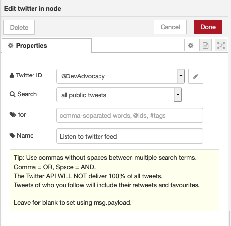
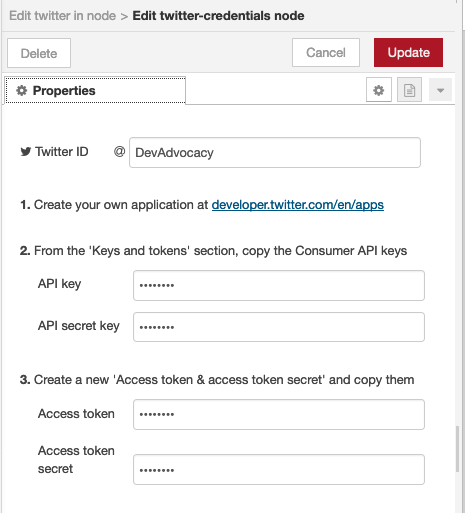

# Twitter Credentials Setup

The Twitter input node needs an active Twitter ID to gather tweets as data input 

Double click on the twitter node when you insert it into node red and you will see something like this : 

To set up a new twitterID click on the pencil button on the side of Twitter ID 

You will need an active twitter account and the API Key, API secret key , Access token and Access token secret to set up your account 

### Go to : [How to create a Twitter application](https://docs.inboundnow.com/guide/create-twitter-application/) to get your keys for Twitter node 

Once you have your keys from your twitter app you can add the associated info into the Twitter input node!

