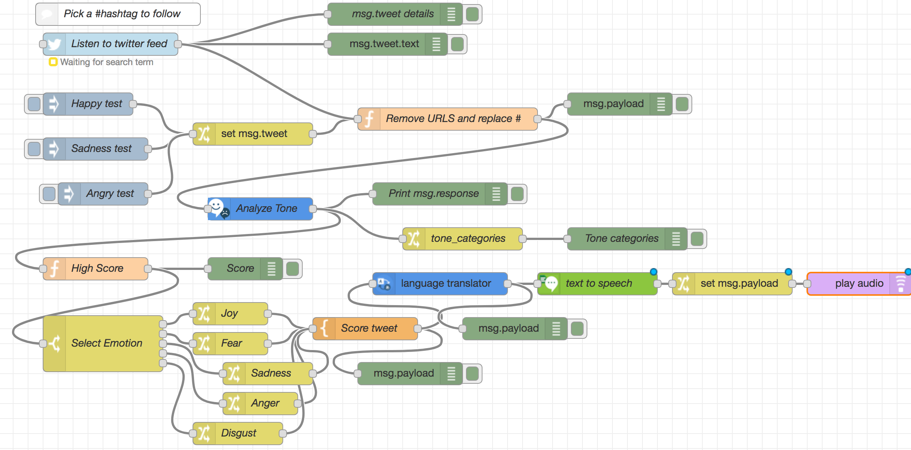

# Tweet Language

This flow takes translates the tone output into any language and then speaks the tone and the tweet in that language. 

### How to Build this Flow

#### Step 1 : Copy the flow from Tweet Tone 

Copy the flow from Tweet Tone and paste nodes into this new project 

#### Step 2: Set up Language Translator Service 

Insert Language Translator Node  from IBM Watson palette and connect to output of Score Tweet Node. 

Get Access to Language Translator 

* Log into IBM Cloud and Go to IBM Cloud Catalog 
* Search for Language Translator Service within Catalog

* Create Lite Service 

* Go to created Service and get service credentials for Langrage Translator 
* Set up node properties with username , password and API key from service credentials 

#### Step 3. Insert Text to Speech service \( created in Tweet Speech\) to Language Translator 

Insert Text to speech service node and connect with Language Translator Node . Use Service credentials from Tweet Speech project. 

Connect change node to change msg.payload to msg.speach 

Connect play audio node to change node 

#### Step 4. Deploy 

Once this flow is deployed you should be able to hear whether a tweet  expresses Joy, Fear , Sadness , Anger or Disgust ! 

